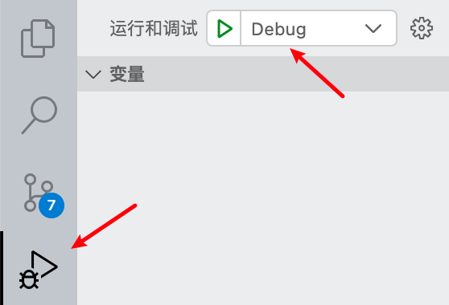

# 环境搭建（Mac m1 pro）
## VS Code & clang++
- 官网下载VS Code
- VS Code左下角设置， 将auto save改为after delay（可选），方便写代码
- mac终端输入命令 ```clang++ --version``` 查看mac是否安装了clang++，未安装输入命令 ```xcode-select --install``` 安装即可
- VS Code安装插件：C/C++、C/C++ Extension Pack、Code Runner、CodeLLDB 
- Code Runner配置：
    - 勾选Clear Previous Output(根据需要选择，勾选后每次运行会清除之前的输出)
    - 勾选Ignore Select（每次运行整个文件而不是选中部分，比较符合习惯）
    - 取消勾选Preserve Focus，这样运行程序，光标自动移动到终端，方便输入
    - 勾选Run In Terminal，否则不能输入，只能输出
    - 勾选Save all files before run、Save file before run，启用运行前保存
- 配置调试
    - command+shift+p，搜索task，选择**配置任务-clang++生成活动文件**（C语言选择clang）
    - 在最左侧一栏选择调试模块（在扩展上面一个带虫子的运行图标），然后选择**生成launch.json文件**，选择**LLDB**，我这里将configurations删除，然后右下角选择添加配置**lldb启动**
    - launch.json配置：
        - name可以自定义，用于修改调试器的名称
        
        

        - program与task的args中最后一个参数一致即（"\${fileDirname}/${fileBasenameNoExtension}"）
        - "externalConsole"改为true
        - 新增一个条目"preLaunchTask": "C/C++: clang++ 生成活动文件"，与task的label一致
- 其他：在设置中搜索debug shortcut并取消勾选可以只显示运行按钮
 ==> 

环境配置完成
## 集成开发环境（IDE）
1. 配置时VS code略显麻烦，总结上述过程：安装VS Code-->检查是否自带clang++ -->安装插件-->配置调试环境task.json和launch.json
2. Windows下VS Code环境配置大同小异，不过新手可以选择一些其他的集成工具，例如
- Dev C++（我本科时的入门工具，小巧轻便）
- Visual Studio（很完善，功能丰富）
- Clion（Jetbrains产品，生态好，参考Pycharm、IDEA）
- 等等，用的顺手就行，我比较喜欢简约和自定义（插件）
3.docker拉取已配置好的环境

## 编译器
关于C++编译器（工具是写代码工具（IDE），编译器用于编译C++语言以用于底层执行）
- GCC：功能强大且广泛使用，windows下常用MinGW-w64（http://www.mingw-w64.org）
- Clang/LLVM：编译速度快，精确的错误消息和警告
- Microsoft Visual C++：集成在Visual Studio中
> note：如有谬误，敬请指正

